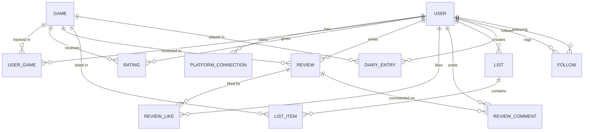

# Backend

## Overview

The Savepoint API. A NestJS service that manages users, game libraries, social
features, and stats, backed by PostgreSQL. Background workers handle Steam
account syncing and game metadata enrichment via Redis-backed queues.

---

## Tech Stack

- **NestJS 11** & **TypeScript**
- **PostgreSQL** with **TypeORM**
- **Redis** with **BullMQ** (background jobs)
- **Passport** + **JWT** (`passport-jwt`) authentication
- **bcrypt** (password hashing)
- **class-validator** / **class-transformer** (DTO validation)
- **Steam Web API** & **RAWG API** integrations
- **Cloudinary** (avatar uploads, via signed REST requests)

---

## System Architecture

- **Modular structure** — each domain is a self-contained NestJS module (controller, service, entities).
- **Layered flow** — controllers validate input and delegate to services; services own all business logic; TypeORM repositories handle persistence.
- **Authentication** — JWT bearer tokens issued on login, validated by a Passport JWT strategy and guard.
- **Background jobs** — long-running work (Steam sync, RAWG enrichment) is offloaded to BullMQ queues and processed by dedicated workers.
- **Validation** — a global `ValidationPipe` (`whitelist`, `transform`) strips unknown fields and coerces types.
- **CORS** — restricted to the configured frontend origin.

---

## Folder Structure

```
backend/
├── src/
│   ├── auth/                  # Login, registration, JWT strategy & guard
│   ├── users/                 # User profiles, avatar uploads (Cloudinary)
│   ├── games/                 # Game catalog, search, browse, enrichment
│   ├── platform-connections/  # External platform links (Steam)
│   ├── steam/                 # Steam Web API client & sync worker
│   ├── rawg/                  # RAWG API client & enrichment worker
│   ├── user-games/            # A user's owned/tracked games
│   ├── ratings/               # Game ratings
│   ├── reviews/               # Reviews, likes, comments
│   ├── lists/                 # Custom game lists
│   ├── diary/                 # Play diary entries
│   ├── social/                # Follows, feeds, public profiles
│   ├── stats/                 # Stats overview & "Wrapped"
│   ├── recommendations/       # Game recommendations
│   ├── database/              # Data source & migrations
│   └── main.ts                # Bootstrap
└── test/
```

---

## Modules

| Module | Responsibility |
| --- | --- |
| `auth` | User registration, login, JWT issuance, and route protection. |
| `users` | Profile data, username/password updates, avatar uploads. |
| `games` | Game records, search, browse, and metadata enrichment triggers. |
| `platform-connections` | Links a user to an external platform (Steam) and tracks sync status. |
| `steam` | Steam Web API client and the `steam-sync` queue worker. |
| `rawg` | RAWG API client and the `rawg-enrich` queue worker. |
| `user-games` | The games a user owns/tracks, with platform, status, and playtime. |
| `ratings` | Per-user, per-game ratings. |
| `reviews` | Reviews plus their likes and comments. |
| `lists` | User-created lists and their ordered items. |
| `diary` | Dated play-session log entries. |
| `social` | Following, activity/playing feeds, and public profile data. |
| `stats` | Aggregated play statistics and the yearly/monthly recap. |
| `recommendations` | Suggested games derived from a user's library. |

---

## Database Design

### Database Engine

PostgreSQL.

### ORM

TypeORM. Schema changes are applied via migrations (`src/database/migrations`);
`synchronize` is disabled.

### Naming Conventions

- **Tables** — explicit `snake_case` names (e.g. `user_games`, `review_likes`).
- **Columns** — `camelCase`, following the entity property names.
- **Primary keys** — UUIDs (`id`).
- **Timestamps** — `createdAt` / `updatedAt` managed by TypeORM.
- **Uniqueness** — enforced with composite unique indexes (e.g. one rating per user per game).

### Entity Relationship Diagram (ERD)



---

## Authentication

- Passwords are hashed with **bcrypt**.
- Login and registration return a signed **JWT** access token (`sub`, `email`, `username`).
- Protected routes use a Passport **JWT strategy** and `JwtAuthGuard`.
- Token secret and expiry are configured via `JWT_SECRET` and `JWT_EXPIRES_IN`.

---

## Background Jobs

Redis-backed BullMQ queues process work outside the request cycle:

| Queue | Purpose |
| --- | --- |
| `steam-sync` | Imports a connected Steam account's owned games and playtime. |
| `rawg-enrich` | Enriches game records with RAWG metadata (covers, genres, etc.). |

---

## Environment Variables

| Variable | Description |
| --- | --- |
| `DATABASE_URL` | PostgreSQL connection string. |
| `REDIS_URL` | Redis connection string (used by BullMQ). |
| `JWT_SECRET` | Secret used to sign JWT access tokens. |
| `JWT_EXPIRES_IN` | JWT lifetime (e.g. `7d`). |
| `STEAM_API_KEY` | Steam Web API key. |
| `RAWG_API_KEY` | RAWG API key. |
| `PORT` | Port the API listens on (default `3001`). |
| `FRONTEND_URL` | Allowed CORS origin for the frontend. |
| `CLOUDINARY_CLOUD_NAME` | Cloudinary cloud name (avatar uploads). |
| `CLOUDINARY_API_KEY` | Cloudinary API key. |
| `CLOUDINARY_API_SECRET` | Cloudinary API secret. |

See `.env.example` for a template.

---

## Getting Started

### Prerequisites

- Node.js
- Docker (for local PostgreSQL and Redis)

### Installation

```bash
npm install
```

### Start dependencies

PostgreSQL and Redis are provided via Docker Compose:

```bash
docker compose up -d
```

### Configure environment

```bash
cp .env.example .env
```

### Run migrations

```bash
npm run migration:run
```

### Running locally

```bash
npm run start:dev
```

The API runs at `http://localhost:3001` by default.

---

## Available Scripts

| Script | Description |
| --- | --- |
| `npm run start` | Start the app. |
| `npm run start:dev` | Start in watch mode. |
| `npm run start:debug` | Start in watch + debug mode. |
| `npm run start:prod` | Run the compiled build (`dist/main`). |
| `npm run build` | Compile the project. |
| `npm run format` | Format sources with Prettier. |
| `npm run lint` | Lint and auto-fix with ESLint. |
| `npm run test` | Run unit tests. |
| `npm run test:watch` | Run unit tests in watch mode. |
| `npm run test:cov` | Run tests with coverage. |
| `npm run test:e2e` | Run end-to-end tests. |
| `npm run migration:generate` | Generate a migration from entity changes. |
| `npm run migration:run` | Apply pending migrations. |
| `npm run migration:revert` | Revert the last migration. |

---

## Coding Guidelines

- **Controllers** — validate input, call services, return responses; no business logic.
- **Services** — own all business logic; may call other services; avoid circular dependencies.
- **DTOs** — always validate with `class-validator` / `class-transformer`.
- **Repositories** — kept thin; complex logic belongs in services.
- **Transactions** — wrap multi-step writes to avoid partial state.
- **Configuration** — never hardcode secrets, URLs, or ports; use `ConfigService`.
- **Import ordering** — Node → external packages → internal aliases → relative → types.

---

## Build

```bash
npm run build
```

Compiles TypeScript to `dist/`. Run the compiled server with `npm run start:prod`.

---

## Deployment

TODO: Document the deployment target and process. Provision PostgreSQL and
Redis, set all environment variables above, run `npm run migration:run`, then
start with `npm run start:prod`.

---

## Troubleshooting

- **Startup fails on missing config** — `DATABASE_URL` and `REDIS_URL` are required and throw on boot if unset.
- **Database connection refused** — ensure `docker compose up -d` is running and the port matches `DATABASE_URL`.
- **Schema out of date** — run `npm run migration:run`.
- **CORS errors** — set `FRONTEND_URL` to the frontend origin.
- **Steam sync stuck** — verify `STEAM_API_KEY` and that Redis is reachable for the `steam-sync` queue.
- **Avatar uploads fail** — set the `CLOUDINARY_*` variables; uploads are disabled when unconfigured.
